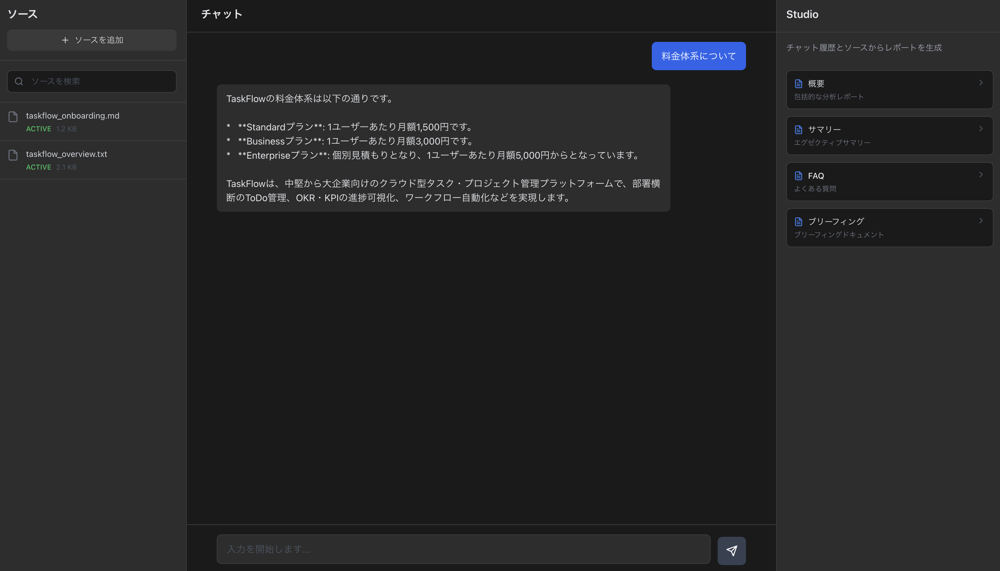

# Document Interaction System

NotebookLMライクなドキュメント対話システム。Google Gemini File Search APIを使用して、複数のドキュメントに対してAIによる質問応答とレポート生成を行います。

## スクリーンショット



## 主要機能

### 1. ソース管理機能
- 複数ファイルのアップロード・管理（PDF, Markdown, テキスト）
- Gemini File Search Storeへの統合
- ドラッグ&ドロップ対応
- ファイルステータス管理（ACTIVE/PENDING/FAILED）
- 個別選択・全選択機能

### 2. チャット機能
- リアルタイムAI会話
- File Search統合による文書検索
- グラウンディングメタデータからの引用表示
- ストリーミング対応

### 3. Studio（レポート生成）
- 包括的な分析レポート
- エグゼクティブサマリー
- FAQ生成
- ブリーフィングドキュメント
- Markdown形式でダウンロード

## 技術スタック

### フロントエンド
- React 18 + TypeScript
- Vite
- Tailwind CSS
- Lucide Icons
- Axios

### バックエンド
- Python 3.11+
- FastAPI
- uvパッケージマネージャー
- Google Generative AI SDK
- Pydantic

### AI統合
- Google Gemini File Search API
- Gemini 2.0 Flash Exp

### インフラ
- Docker + Docker Compose
- PostgreSQL (オプション)

## セットアップ

### 前提条件
- Docker & Docker Compose
- Google Gemini API Key（[Google AI Studio](https://makersuite.google.com/app/apikey)で取得）

### インストール手順

1. **リポジトリをクローン**
```bash
git clone <repository-url>
cd gemini-retrieval-platform
```

2. **環境変数を設定**
```bash
cp .env.example .env
# .envファイルを編集してGEMINI_API_KEYを設定
```

3. **Dockerでビルド＆起動**
```bash
docker-compose up --build
```

4. **コンテナに入る（別ターミナル）**

バックエンドコンテナに入る場合:
```bash
docker-compose exec backend bash
```

フロントエンドコンテナに入る場合:
```bash
docker-compose exec frontend sh
```

コンテナ内でのコマンド実行例:
```bash
# バックエンドコンテナ内
docker-compose exec backend uv run python -m app.main

# フロントエンドコンテナ内
docker-compose exec frontend npm run build
```

実行中のコンテナを確認:
```bash
docker-compose ps
```

ログを確認:
```bash
# 全コンテナのログ
docker-compose logs -f

# バックエンドのみ
docker-compose logs -f backend

# フロントエンドのみ
docker-compose logs -f frontend
```

5. **アクセス**
- フロントエンド: http://localhost:5173
- バックエンドAPI: http://localhost:8000
- APIドキュメント: http://localhost:8000/docs

## ローカル開発（uvを使用）

### バックエンド
```bash
cd backend

# uvで依存関係をインストール
uv sync

# 開発サーバー起動
uv run uvicorn app.main:app --reload
```

### フロントエンド
```bash
cd frontend

# 依存関係をインストール
npm install

# 開発サーバー起動
npm run dev
```

## API エンドポイント

### File Search Store管理
- `POST /api/stores` - Store作成
- `GET /api/stores` - Store一覧取得
- `DELETE /api/stores/{store_id}` - Store削除

### ドキュメント管理
- `POST /api/stores/{store_id}/upload` - ファイルアップロード
- `GET /api/stores/{store_id}/documents` - ドキュメント一覧
- `DELETE /api/documents/{document_id}` - ドキュメント削除
- `GET /api/operations/{operation_id}` - Operation状態確認

### チャット
- `POST /api/chat` - チャットメッセージ送信
- `POST /api/chat/stream` - ストリーミングチャット

### レポート生成
- `POST /api/generate-report` - レポート生成

## プロジェクト構造

```
notebooklm-clone/
├── backend/
│   ├── app/
│   │   ├── main.py                 # FastAPIアプリケーション
│   │   ├── models/
│   │   │   └── schemas.py          # Pydanticスキーマ
│   │   ├── routes/
│   │   │   ├── stores.py           # Store管理エンドポイント
│   │   │   ├── documents.py        # ドキュメント管理
│   │   │   ├── chat.py             # チャットエンドポイント
│   │   │   └── report.py           # レポート生成
│   │   ├── services/
│   │   │   ├── file_search_service.py  # File Search API統合
│   │   │   └── gemini_service.py       # Gemini AI統合
│   │   └── utils/
│   │       └── storage.py          # ファイルストレージ
│   ├── pyproject.toml              # Python依存関係
│   └── Dockerfile
├── frontend/
│   ├── src/
│   │   ├── components/
│   │   │   ├── SourcePanel.tsx     # ソース管理UI
│   │   │   ├── ChatPanel.tsx       # チャットUI
│   │   │   ├── StudioPanel.tsx     # Studioパネル
│   │   │   └── CitationDisplay.tsx # 引用表示
│   │   ├── services/
│   │   │   └── api.ts              # APIクライアント
│   │   ├── types/
│   │   │   └── index.ts            # TypeScript型定義
│   │   ├── App.tsx                 # メインアプリ
│   │   └── main.tsx
│   ├── package.json
│   ├── vite.config.ts
│   ├── tailwind.config.js
│   └── Dockerfile
├── docker-compose.yml
├── .env.example
└── README.md
```

## 使い方

### 1. ドキュメントのアップロード
1. 左パネルの「ソースを追加」ボタンをクリック
2. PDF、Markdown、テキストファイルを選択
3. ファイルが処理されるまで待つ（ステータスがACTIVEになるまで）

### 2. チャットで質問
1. アップロードしたドキュメントを選択（チェックボックス）
2. 中央のチャット入力欄に質問を入力
3. AIがドキュメントを参照して回答
4. 引用元が表示される

### 3. レポート生成
1. チャット履歴がある状態で、右下のStudioボタンをクリック
2. レポートタイプを選択（概要、サマリー、FAQ、ブリーフィング）
3. 生成されたレポートをプレビュー
4. ダウンロードボタンでMarkdownファイルとして保存

## トラブルシューティング

### ファイルアップロードが失敗する
- ファイルサイズが10MB以下か確認
- 対応形式（PDF、MD、TXT）か確認
- GEMINI_API_KEYが正しく設定されているか確認

### チャットが応答しない
- ドキュメントのステータスがACTIVEか確認
- 少なくとも1つのドキュメントが選択されているか確認
- バックエンドのログを確認（`docker-compose logs backend`）

### Dockerビルドエラー
- Dockerが最新版か確認
- `.env`ファイルが存在するか確認
- ポート8000と5173が使用可能か確認


## 開発者向け情報

### コード品質
```bash
# バックエンド
cd backend
uv run pylint app/

# フロントエンド
cd frontend
npm run lint
```

### テスト
```bash
# バックエンド
cd backend
uv run pytest

# フロントエンド
cd frontend
npm test
```

### ビルド
```bash
# プロダクションビルド
docker-compose -f docker-compose.prod.yml up --build
```

